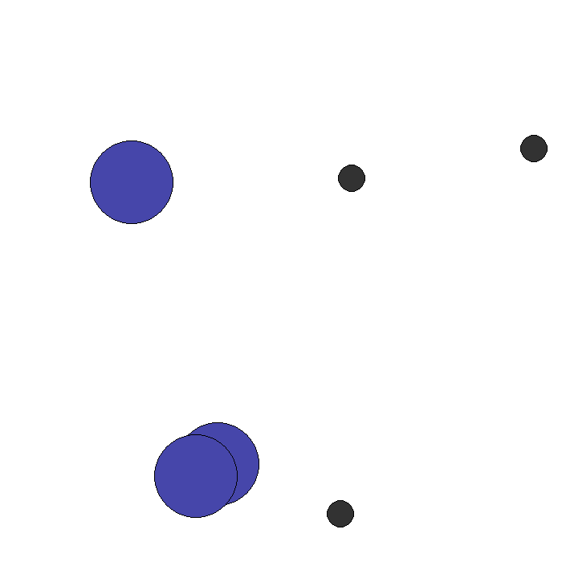

#MARL Onboarding - Day 5: IPPO on simple_spread
Multi-agent reinforcement learning with Independent PPO on the simple_spread environment

## Setup
```bash
pip install -r requirements.txt
```

## Implementations
### Core Algorithms
- **Implement IPPO with independent policies**
    -File: `simple_IPPO.py`
- **Implement IPPO with shared policies**
    -File: `simple_IPPO_shared_policy.py`,`simple_IPPO_gpu.py`, `simple_IPPO_n5.py`
### IPPO Variants
- **IPPO with shared policies**
    - All agents share the same network architecture
    - File:`simple_IPPO_shared_policy.py`
- **IPPO with GPU support**
    - GPU training for faster convergence
    - File: `simple_IPPO_gpu.py`
- **IPPO with 5 agents** 
    - Scaled to a larger environment for comparison
    -File: `simple_IPPO_n5.py`

## Training
```bash
python simple_IPPO_gpu.py   # 3 agents
python simple_IPPO_n5.py    # 5 agents
```

## Render
```bash
python render_ippo.py
```


## Results
| Agents | Initial Reward | Final Reward | Updates |
|--------|---------------|--------------|---------|
| N=3    | -25.9         | -22.8        | 2000    |
| N=5    | -34.1         | -31.9        | 500     |

IPPO's structural limitation is that each agent only observes its own state — agents have no knowledge of other agents' positions or intentions.