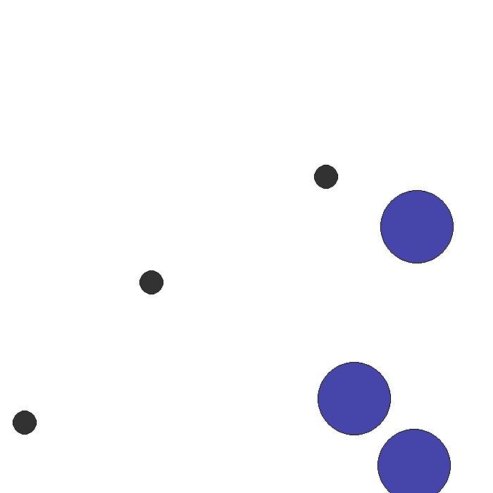

# Day 9 — Fault-Aware Training: Curriculum Learning + Topology Adaptation

MAPPO + CommNet tabanlı arıza toleranslı çok ajanlı öğrenme. `simple_spread_v3` (mpe2 / PettingZoo), N=3 kooperatif ajan, N=3 landmark.

Üç strateji karşılaştırılmaktadır:

| Strateji | Açıklama |
|---|---|
| **A** | Naive baseline — arıza farkındalığı yok |
| **B** | Curriculum learning — arıza şiddeti kademeli artırılır, fault indicator gözleme eklenir |
| **C** | Online fault detection + topology reconfiguration (oracle bilgisi gerektirmez) |

## Sonuçlar (3 seed ortalaması)

**Kapsam Oranı (Coverage)**

| Senaryo | A | B | C |
|---|---|---|---|
| S1 – Arızasız | 0.830 | 0.830 | 0.833 |
| S2 – Fail-stop | 0.370 | 0.644 | 0.642 |
| S3 – Byzantine | 0.063 | 0.257 | **0.628** |
| S4 – Intermittent | 0.650 | 0.651 | 0.648 |

**Reward**

| Senaryo | A | B | C |
|---|---|---|---|
| S1 – Arızasız | -0.302 | -0.294 | -0.291 |
| S2 – Fail-stop | -0.698 | -0.444 | -0.460 |
| S3 – Byzantine | -1.761 | -0.960 | **-0.480** |
| S4 – Intermittent | -0.455 | -0.455 | -0.450 |

**Temel bulgular:**
- **S2 Fail-stop:** B ≈ C — curriculum tek başına topology isolation kadar etkili
- **S3 Byzantine:** C açık farkla kazanıyor (0.628 vs 0.257); curriculum adversarial mesajlara yetmiyor, aktif izolasyon şart
- **S4 Intermittent:** Üç strateji özdeş — stokastik dropout doğası gereği tolere ediliyor
- **Detector:** Tüm C deneyleri boyunca precision=1.0, recall≥0.987 — sıfır yanlış alarm

## Mimari

**CommNetActor** iki aşamada çalışır:

```
encode(obs) → h_i          # her ajan gizli vektör üretir
    ↓
inject_message_faults()    # arıza enjeksiyonu burada (mesaj seviyesinde)
    ↓
aggregate_and_policy(h, A) # komşu mesajları adjacency ile toplanır → aksiyon
```

İki metodun ayrılması arıza enjeksiyonunu mimari değişikliği gerektirmeden mümkün kılar.

**FaultDetector (v4)** beş sinyal üretir:

| Sinyal | Açıklama |
|---|---|
| `z_self` | Ajanın norm geçmişine göre z-skoru |
| `z_cv` | Norm değişim katsayısının z-skoru |
| `z_fleet` | Filo median'ından sapma |
| `cos_drop` | Cosine benzerliğindeki düşüş |
| `coherence_drop` | EMA kohezyon düşüşü |

K=3 sinyal eşiği aşarsa → suspect; M=5 ardışık adım suspect → flagged (histerezis).

**TopologyManager:** Flagged ajanın adjacency matrisindeki tüm in/out edge'lerini sıfırlar, self-loop korunur.

**CurriculumScheduler (Strateji B):** Arıza intensity'sini 0→1 doğrusal ramp ile artırır; kapsam plato yaptığında bump mekanizmasıyla sıçramalı artış uygular.

## Reward Shaping

Ham MPE ödülüne üç bileşen eklendi:

```
r_shaped = r_ham
         + 0.5 * mean(exp(-5 * d_j))   # navigasyon gradyanı
         + 0.8 * mean(1[d_j < 0.15])   # commitment bonusu
         + 0.3 * unique_ratio           # yayılma bonusu (kümelenme önleme)
```

## Kurulum

```bash
conda create -n rl-env python=3.10
conda activate rl-env
pip install -r requirements.txt
```

## Çalıştırma

Tek koşu:

```bash
python model_train.py \
    --config configs/S3_byzantine.yaml \
    --strategy C \
    --seed 0 \
    --topology configs/topology_full.json \
    --wandb
```

Tam sweep (3 strateji × 4 senaryo × 3 seed = 36 run):

```bash
bash run_all.sh
```

Smoke test (hızlı doğrulama):

```bash
bash run_all.sh smoke
```

Çıktı: `checkpoints_v2/day9_v2_{strategy}_{scenario}_seed{seed}.pt`

## Repo Yapısı

```
day9_FAT/
├── model_train.py       # MAPPO + CommNet eğitim döngüsü, paralel rollout, fault injection
├── render.py            # eğitilmiş checkpoint'ten GIF render
├── src/adaptation.py    # CurriculumScheduler, FaultDetector, TopologyManager
├── configs/
│   ├── S1_nofault.yaml
│   ├── S2_fail_stop.yaml
│   ├── S3_byzantine.yaml
│   ├── S4_intermittent.yaml
│   └── topology_full.json
├── checkpoints_v2/      # eğitilmiş modeller
├── renders_new/         # demo GIF'ler
├── run_all.sh           # tam sweep
└── requirements.txt
```

## Demo GIF'ler

Eğitilmiş policy'lerin `simple_spread_v3` ortamındaki davranışları (seed=0, 150 adım).

### Arızasız (S1)

| A (naive) | B (curriculum) | C (detect+adapt) |
|---|---|---|
|  |  |  |

### Fail-stop (S2)

| A (naive) | B (curriculum) | C (detect+adapt) |
|---|---|---|
|  |  |  |

### Byzantine (S3)

> A tamamen çöküyor (coverage ≈ 0.06). B curriculum ile kısmen adapte oluyor (0.43, seed'e göre değişken). C arızalı ajanı tespit edip grafikten çıkarıyor ve stabil koordinasyon sağlıyor (0.628).

| A (naive) | B (curriculum) | C (detect+adapt) |
|---|---|---|
|  |  |  |

### Intermittent (S4)

| A (naive) | B (curriculum) | C (detect+adapt) |
|---|---|---|
|  |  |  |
